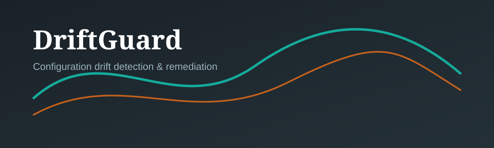

# DriftGuard

**Configuration drift detection & remediation assistant** for mixed IT environments — Linux, Windows, network devices, and basic cloud.



DriftGuard snapshots configuration (files, packages, services, registry stubs, cloud resources), compares it to desired/golden state, visualizes side-by-side diffs with severity, and walks operators through **dry-run → approve → apply** remediation with RBAC and audit.

> **Repo note:** This project currently lives under `DriftGuard/` in the [PowerShell](https://github.com/btstevens1984az/PowerShell) monorepo and is structured to extract cleanly into `https://github.com/btstevens1984az/DriftGuard`.

---

## Demo videos

Ten short walkthroughs are embedded on the product landing page (`/`):

| # | Topic |
|---|--------|
| 01 | Fleet drift posture dashboard |
| 02 | Running collectors |
| 03 | Side-by-side diff viewer |
| 04 | Severity ranking |
| 05 | Approval workflow |
| 06 | Safe dry-run apply |
| 07 | Desired-state baselines |
| 08 | Options & settings |
| 09 | RBAC & audit |
| 10 | Install on Windows & Linux |

Videos ship in `frontend/public/videos/` and `media/videos/`.

---

## Quick start

### Docker Compose (Linux, macOS, Windows)

```bash
cd DriftGuard
docker compose up --build
```

| Surface | URL |
|---------|-----|
| UI + landing | http://localhost:5173 |
| API docs | http://localhost:8000/docs |
| Health | http://localhost:8000/health |

**Demo login:** `admin@driftguard.example` / `DriftGuard!admin`  
Also: `ops@…` / `DriftGuard!ops`, `viewer@…` / `DriftGuard!view`

### Local (no Docker)

**Linux:** see [docs/INSTALL_LINUX.md](docs/INSTALL_LINUX.md)  
**Windows:** see [docs/INSTALL_WINDOWS.md](docs/INSTALL_WINDOWS.md)

```bash
# Backend
cd backend && python3 -m venv .venv && source .venv/bin/activate
pip install -r requirements.txt
export DATABASE_URL=sqlite:///./driftguard.db SEED_DEMO_DATA=true SECRET_KEY=dev
uvicorn app.main:app --reload --port 8000

# Frontend
cd frontend && npm install && npm run dev
```

---

## Features

- **Collectors:** SSH (Paramiko), WinRM stub, agent push, local self-check, cloud API stub  
- **Desired state:** YAML/JSON golden configs; Git sync flags in Settings  
- **Drift engine:** file / package / service / registry / cloud diffs with severity scoring  
- **Dashboard:** drift score, affected systems, 14-day timeline, approval queue  
- **Remediation:** dry-run first, admin approval, audited apply  
- **Security:** JWT auth, RBAC (admin/operator/viewer/auditor), Fernet-ready secrets, audit log  
- **Stack:** FastAPI · SQLAlchemy · PostgreSQL/SQLite · React · TypeScript · Tailwind · pytest · GitHub Actions · Docker Compose  

---

## Project structure

```
DriftGuard/
├── backend/           # FastAPI API, collectors, drift engine, tests
├── frontend/          # React console + marketing landing
├── agents/            # Lightweight agent CLI stub
├── desired-state/     # Example golden YAML
├── docs/              # Install (Win/Linux), settings, architecture
├── media/videos/      # Demo clips for README / GitHub
├── docker-compose.yml
└── README.md
```

---

## Options & settings

Full reference: **[docs/SETTINGS.md](docs/SETTINGS.md)**

Highlights:

- Console toggles for collector interval, dry-run default, Git sync, webhooks, session lifetime  
- Env vars: `DATABASE_URL`, `SECRET_KEY`, `SECRETS_FERNET_KEY`, `SEED_DEMO_DATA`, `CORS_ORIGINS`, …  

---

## Tests & CI

```bash
cd backend && pytest -q
cd frontend && npm run build
```

GitHub Actions workflow: `.github/workflows/driftguard.yml` (repo root).

---

## License

MIT — see repository root `LICENSE`.
