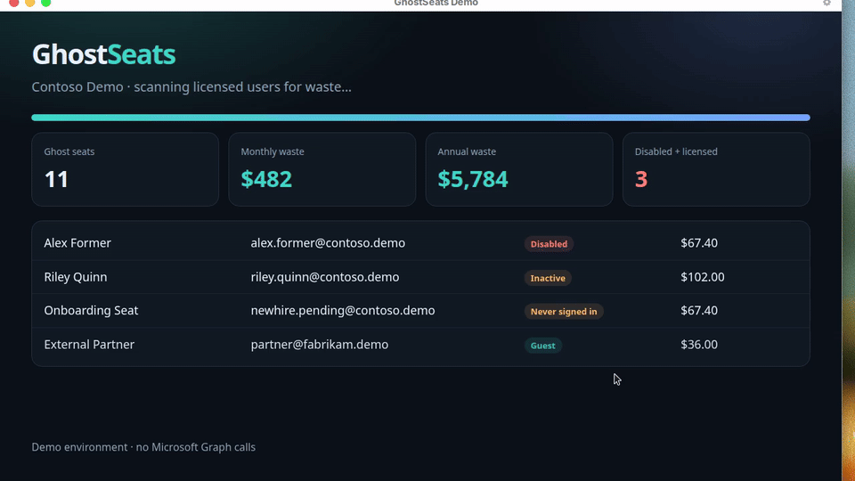

# GhostSeats

**Find the ghost seats draining your Microsoft 365 budget.**

GhostSeats is a PowerShell module for IT departments that discovers unused Microsoft 365 licenses, estimates waste in dollars, exports leadership-ready reports, and automates reclaim with approval-list safety rails.

> **Status:** Ready for review — **not published** to the PowerShell Gallery until you approve.



---

## Why IT teams care

Licenses stick to disabled accounts, unfinished onboardings, and dormant mailboxes. GhostSeats turns that into a 60-second report your CFO and helpdesk both understand.

| Category | What it means |
|---|---|
| **DisabledAccount** | Account off, license still on |
| **NeverSignedIn** | Licensed, zero successful sign-ins |
| **Inactive** | No sign-in inside your threshold (default 90 days) |
| **GuestWithLicense** | Guest holding member SKUs |

Break-glass, service accounts, and Executive/Legal are excluded by default.

---

## Quick start (demo — zero tenant risk)

```powershell
Import-Module ./GhostSeats/GhostSeats.psd1
Start-GhostSeatDemo -OpenReport
```

Or step-by-step:

```powershell
Import-Module ./GhostSeats/GhostSeats.psd1
Connect-GhostSeats -Demo
Get-GhostSeat | Format-Table
Get-GhostSeatSummary
Export-GhostSeatReport -Path ./reports -Open
Invoke-GhostSeatAutomation -OutputPath ./out -AutoApproveDisabled
```

## Live tenant

```powershell
Install-Module Microsoft.Graph.Authentication, Microsoft.Graph.Users, Microsoft.Graph.Identity.DirectoryManagement -Scope CurrentUser

Import-Module ./GhostSeats/GhostSeats.psd1
Connect-GhostSeats   # interactive Graph login
Get-GhostSeat | Export-GhostSeatReport -Path ./reports -Open

# Change-control path
New-GhostSeatApprovalList -Path ./approvals/week.csv -PreApproveDisabledAccounts
# ... managers set Approved=true ...
Invoke-GhostSeatReclaim -ApprovalListPath ./approvals/week.csv -WhatIf
Invoke-GhostSeatReclaim -ApprovalListPath ./approvals/week.csv
```

### Graph permissions

| Permission | Purpose |
|---|---|
| `User.Read.All` | Read users + licenses |
| `Directory.Read.All` | Directory inventory |
| `Organization.Read.All` | Subscribed SKUs |
| `AuditLog.Read.All` | Sign-in activity |
| `User.ReadWrite.All` | Reclaim only |

---

## Automation

`Invoke-GhostSeatAutomation` is built for Azure Automation, Task Scheduler, or CI:

1. Scan ghost seats  
2. Export HTML / CSV / JSON  
3. Write approval CSV  
4. Optionally reclaim `Approved=true` rows (`-ExecuteReclaim`)

```powershell
Invoke-GhostSeatAutomation -OutputPath ./out -AutoApproveDisabled -ExecuteReclaim -WhatIf
```

Every connect / scan / export / reclaim writes to a JSONL audit log (`Get-GhostSeatConfig`.AuditLogPath).

---

## Demo videos

Short Contoso demo clips (for the GitHub README) live in [`demos/media/`](demos/media/):

| Clip | File |
|---|---|
| Scan & summary | `ghostseats-scan.mp4` / `.gif` |
| HTML report | `ghostseats-report.mp4` / `.gif` |
| Automation + reclaim | `ghostseats-automation.mp4` / `.gif` |

Regenerate:

```powershell
pwsh -File ./scripts/New-DemoMedia.ps1
```

---

## Commands

| Command | Alias | Purpose |
|---|---|---|
| `Connect-GhostSeats` | | Graph or `-Demo` |
| `Get-GhostSeat` | `ggs` | Find ghost seats |
| `Get-GhostSeatSummary` | | Totals + $ waste |
| `Export-GhostSeatReport` | `egsr` | HTML / CSV / JSON |
| `New-GhostSeatApprovalList` | | Change-control CSV |
| `Invoke-GhostSeatReclaim` | `igs` | Remove approved licenses |
| `Invoke-GhostSeatAutomation` | | Full pipeline |
| `Start-GhostSeatDemo` | | Polished Contoso demo |
| `Get-GhostSeatSkuCatalog` | | Price / friendly names |
| `Set-GhostSeatConfig` | | Thresholds & exclusions |

---

## Project layout

```
GhostSeats/
├── GhostSeats.psd1 / .psm1
├── Public/  Private/  Tests/  config/  docs/  demos/
└── scripts/New-DemoMedia.ps1
```

Intended local checkout path on your Mac:

`/Users/brandonstevens/Cursor Projects/GhostSeats`

---

## Tests

```powershell
Invoke-Pester -Path ./Tests/GhostSeats.Tests.ps1 -Output Detailed
```

## License

MIT — see [LICENSE](LICENSE).

**Not published to PowerShell Gallery yet.** Approve the module first, then we can ship.
