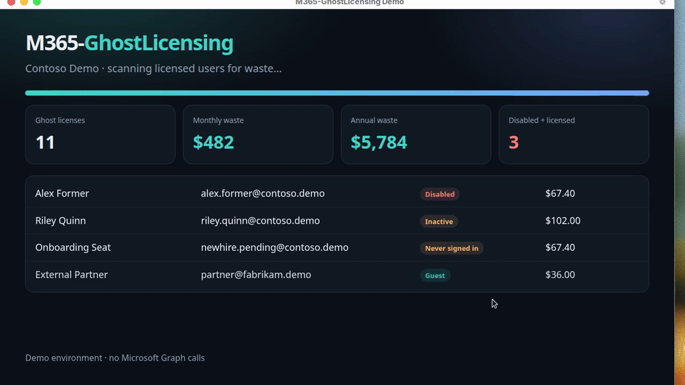
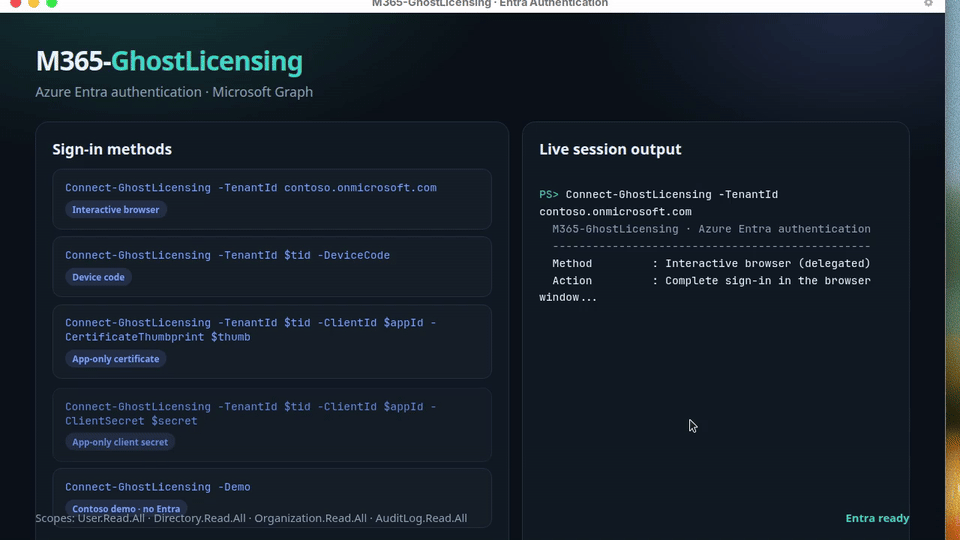

# M365-GhostLicensing

**Find unused Microsoft 365 licenses before they burn budget.**

PowerShell module for IT departments: discover ghost licenses, estimate waste in dollars, export leadership-ready reports, authenticate to Azure Entra ID, and automate reclaim with approval-list safety rails.

> **Status:** Ready for review — **not published** to the PowerShell Gallery until you approve.



---

## Quick start (demo — zero tenant risk)

```powershell
Import-Module ./M365-GhostLicensing/M365-GhostLicensing.psd1
Start-GhostLicensingDemo -OpenReport
```

## Authenticate to Azure Entra ID

```powershell
Install-Module Microsoft.Graph.Authentication, Microsoft.Graph.Users, Microsoft.Graph.Identity.DirectoryManagement -Scope CurrentUser
Import-Module ./M365-GhostLicensing/M365-GhostLicensing.psd1

# Interactive browser (most common)
Connect-GhostLicensing -TenantId 'contoso.onmicrosoft.com'

# Device code (jump box / no local browser)
Connect-GhostLicensing -TenantId $tid -DeviceCode

# App-only certificate (automation)
Connect-GhostLicensing -TenantId $tid -ClientId $appId -CertificateThumbprint $thumb

# App-only client secret
$secret = Read-Host 'Client secret' -AsSecureString
Connect-GhostLicensing -TenantId $tid -ClientId $appId -ClientSecret $secret

# Contoso demo (no Entra)
Connect-GhostLicensing -Demo
```

See [docs/AUTHENTICATION.md](docs/AUTHENTICATION.md).



---

## Discover → report → reclaim

```powershell
Get-GhostLicense | Format-Table
Get-GhostLicenseSummary
Export-GhostLicenseReport -Path ./reports -Open

New-GhostLicenseApprovalList -Path ./approvals/week.csv -PreApproveDisabledAccounts
Invoke-GhostLicenseReclaim -ApprovalListPath ./approvals/week.csv -WhatIf
Invoke-GhostLicenseAutomation -OutputPath ./out -AutoApproveDisabled
```

| Category | Meaning |
|---|---|
| **DisabledAccount** | Account off, license still on |
| **NeverSignedIn** | Licensed, zero successful sign-ins |
| **Inactive** | No sign-in inside your threshold (default 90 days) |
| **GuestWithLicense** | Guest holding member SKUs |

Break-glass, service accounts, and Executive/Legal are excluded by default.

---

## Commands

| Command | Alias | Purpose |
|---|---|---|
| `Connect-GhostLicensing` | | Entra / Graph / Demo auth |
| `Disconnect-GhostLicensing` | | End session |
| `Get-GhostLicense` | `ggl` | Find ghost licenses |
| `Get-GhostLicenseSummary` | | Totals + $ waste |
| `Export-GhostLicenseReport` | `eglr` | HTML / CSV / JSON |
| `New-GhostLicenseApprovalList` | | Change-control CSV |
| `Invoke-GhostLicenseReclaim` | `iglr` | Remove approved licenses |
| `Invoke-GhostLicenseAutomation` | | Full pipeline |
| `Start-GhostLicensingDemo` | | Polished Contoso demo |
| `Get-GhostLicenseSkuCatalog` | | Price / friendly names |
| `Get-GhostLicensingConfig` / `Set-GhostLicensingConfig` | | Thresholds & exclusions |

---

## Demo videos (~5 seconds)

| Clip | File |
|---|---|
| Entra authentication | `demos/media/ghostlicensing-auth.mp4` / `.gif` |
| Scan & summary | `demos/media/ghostlicensing-scan.mp4` / `.gif` |
| HTML report | `demos/media/ghostlicensing-report.mp4` / `.gif` |
| Automation + reclaim | `demos/media/ghostlicensing-automation.mp4` / `.gif` |

Regenerate:

```powershell
pwsh -File ./scripts/New-DemoMedia.ps1
```

---

## Project layout

```
M365-GhostLicensing/
├── M365-GhostLicensing.psd1 / .psm1
├── Public/  Private/  Tests/  config/  docs/  demos/
└── scripts/New-DemoMedia.ps1
```

Intended Mac path: `/Users/brandonstevens/Cursor Projects/M365-GhostLicensing`

---

## Tests

```powershell
Invoke-Pester -Path ./Tests/M365-GhostLicensing.Tests.ps1 -Output Detailed
```

## License

MIT — see [LICENSE](LICENSE).

**Not published to PowerShell Gallery yet.** Approve the module first, then we can ship.
