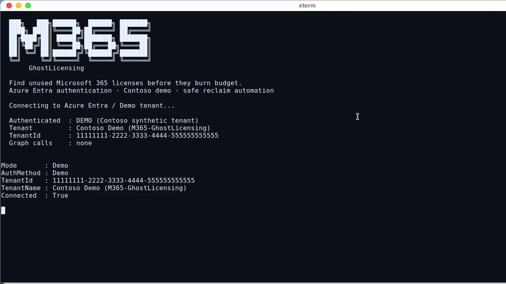
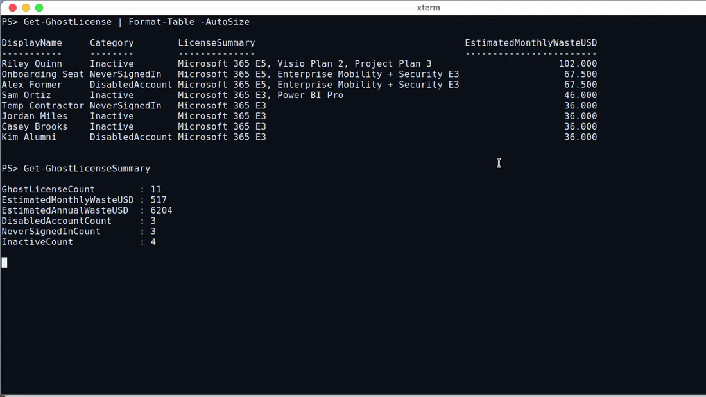
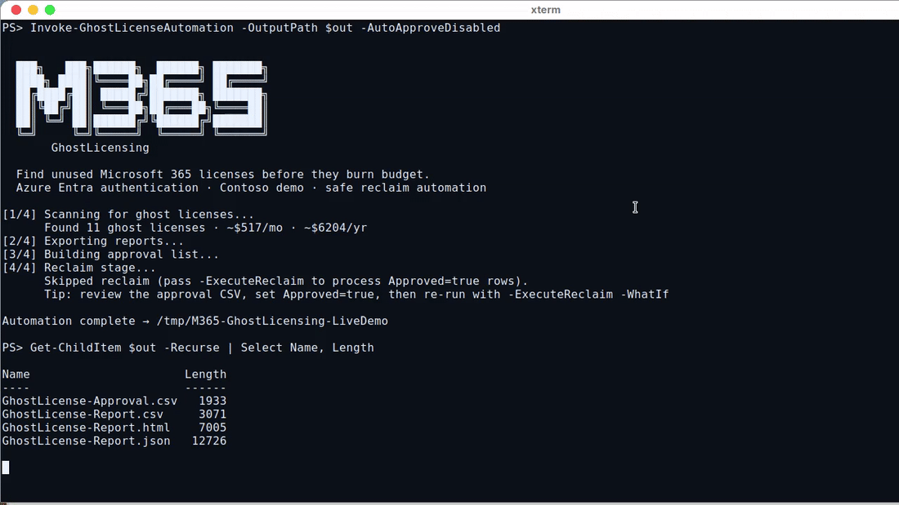

# M365-GhostLicensing

**Find unused Microsoft 365 licenses before they burn budget.**

PowerShell module for IT departments. Authenticate to Azure Entra ID, discover unused (“ghost”) licenses, estimate monthly/annual waste, export HTML/CSV/JSON reports, and reclaim safely with approval-list automation.





---

## Table of contents

1. [What it does](#what-it-does)
2. [Requirements](#requirements)
3. [Install from PowerShell Gallery](#install-from-powershell-gallery)
4. [Install from GitHub](#install-from-github)
5. [Quick start (demo — no Entra)](#quick-start-demo--no-entra)
6. [Connect to your Entra tenant](#connect-to-your-entra-tenant)
7. [Scan, report, reclaim](#scan-report-reclaim)
8. [Automation](#automation)
9. [Commands](#commands)
10. [Demo videos](#demo-videos)
11. [Docs](#docs)
12. [Tests](#tests)
13. [License](#license)

---

## What it does

| Category | Meaning |
|---|---|
| **DisabledAccount** | Account disabled, license still assigned |
| **NeverSignedIn** | Licensed with no successful sign-in |
| **Inactive** | No sign-in within your threshold (default 90 days) |
| **GuestWithLicense** | Guest holding member SKUs |

Break-glass, service accounts, and Executive/Legal departments are excluded by default.

---

## Requirements

- **PowerShell 7.4+** (recommended) or Windows PowerShell 5.1  
- For live tenants: Microsoft Graph modules + Entra permissions (see [docs/AUTHENTICATION.md](docs/AUTHENTICATION.md))  
- Demo mode needs **no** Entra / Graph access

Check your PowerShell version:

```powershell
$PSVersionTable.PSVersion
```

---

## Install from PowerShell Gallery

```powershell
# Trust Gallery once (optional but common in locked-down hosts)
Set-PSRepository -Name PSGallery -InstallationPolicy Trusted

# Install for your user (no admin required)
Install-Module -Name M365-GhostLicensing -Scope CurrentUser -Repository PSGallery -Force

# Load and verify
Import-Module M365-GhostLicensing
Get-Command -Module M365-GhostLicensing
```

Update:

```powershell
Update-Module -Name M365-GhostLicensing -Force
```

Uninstall:

```powershell
Remove-Module M365-GhostLicensing -ErrorAction SilentlyContinue
Uninstall-Module M365-GhostLicensing -AllVersions -Force
```

> Full step-by-step install guide (Gallery + GitHub + troubleshooting): **[docs/INSTALL.md](docs/INSTALL.md)**

---

## Install from GitHub

```powershell
git clone https://github.com/btstevens1984az/M365-GhostLicensing.git
Set-Location M365-GhostLicensing
Import-Module ./M365-GhostLicensing.psd1 -Force
```

Optional — copy into your personal module path so `Import-Module M365-GhostLicensing` works from any folder:

```powershell
$dest = Join-Path (($env:PSModulePath -split [IO.Path]::PathSeparator)[0]) 'M365-GhostLicensing'
New-Item -ItemType Directory -Path $dest -Force | Out-Null
Copy-Item -Path ./* -Destination $dest -Recurse -Force
Import-Module M365-GhostLicensing -Force
```

---

## Quick start (demo — no Entra)

```powershell
Import-Module M365-GhostLicensing
Start-GhostLicensingDemo -OpenReport
```

Or manually:

```powershell
Connect-GhostLicensing -Demo
Get-GhostLicense | Format-Table
Get-GhostLicenseSummary
Export-GhostLicenseReport -Path ./reports -Open
```

---

## Connect to your Entra tenant

Install Graph dependencies once:

```powershell
Install-Module Microsoft.Graph.Authentication, Microsoft.Graph.Users, Microsoft.Graph.Identity.DirectoryManagement -Scope CurrentUser -Force
```

### Interactive browser

```powershell
Connect-GhostLicensing -TenantId 'contoso.onmicrosoft.com'
```

### Device code

```powershell
Connect-GhostLicensing -TenantId $tid -DeviceCode
```

### App-only certificate (automation)

```powershell
Connect-GhostLicensing -TenantId $tid -ClientId $appId -CertificateThumbprint $thumb
```

### App-only client secret

```powershell
$secret = Read-Host 'Client secret' -AsSecureString
Connect-GhostLicensing -TenantId $tid -ClientId $appId -ClientSecret $secret
```

### Contoso demo

```powershell
Connect-GhostLicensing -Demo
```

Verify / disconnect:

```powershell
Get-GhostLicensingConfig | Select-Object Connected, DemoMode, TenantId, AuthMethod
Disconnect-GhostLicensing
```

---

## Scan, report, reclaim

```powershell
Get-GhostLicense | Format-Table
Get-GhostLicenseSummary
Export-GhostLicenseReport -Path "$HOME/GhostLicensing-Reports" -Open

New-GhostLicenseApprovalList -Path ./approvals/week.csv -PreApproveDisabledAccounts
# Edit CSV → set Approved=true for rows to reclaim

Invoke-GhostLicenseReclaim -ApprovalListPath ./approvals/week.csv -WhatIf
Invoke-GhostLicenseReclaim -ApprovalListPath ./approvals/week.csv
```

---

## Automation

```powershell
Invoke-GhostLicenseAutomation -OutputPath ./out -AutoApproveDisabled -OpenReport
# Add -ExecuteReclaim only after approval CSV review
```

Designed for Azure Automation, Task Scheduler, and CI. See [docs/AUTOMATION.md](docs/AUTOMATION.md).

---

## Commands

| Command | Alias | Purpose |
|---|---|---|
| `Connect-GhostLicensing` | | Entra / Graph / Demo auth |
| `Disconnect-GhostLicensing` | | End session |
| `Get-GhostLicense` | `ggl` | Find ghost licenses |
| `Get-GhostLicenseSummary` | | Totals + estimated waste |
| `Export-GhostLicenseReport` | `eglr` | HTML / CSV / JSON |
| `New-GhostLicenseApprovalList` | | Change-control CSV |
| `Invoke-GhostLicenseReclaim` | `iglr` | Remove approved licenses |
| `Invoke-GhostLicenseAutomation` | | Full pipeline |
| `Start-GhostLicensingDemo` | | Contoso demo |
| `Get-GhostLicenseSkuCatalog` | | SKU prices / friendly names |
| `Get-GhostLicensingConfig` / `Set-GhostLicensingConfig` | | Thresholds & exclusions |

---

## Demo videos

Live Contoso demo recordings (5–10 seconds):

| Clip | File |
|---|---|
| Authenticate (demo session) | [`demos/media/live-auth.mp4`](demos/media/live-auth.mp4) |
| Scan ghost licenses | [`demos/media/live-scan.mp4`](demos/media/live-scan.mp4) |
| Automation pipeline | [`demos/media/live-automation.mp4`](demos/media/live-automation.mp4) |
| Entra methods overview | [`demos/media/ghostlicensing-auth.mp4`](demos/media/ghostlicensing-auth.mp4) |
| HTML report | [`demos/media/ghostlicensing-report.mp4`](demos/media/ghostlicensing-report.mp4) |

Regenerate media:

```powershell
pwsh -File ./scripts/New-DemoMedia.ps1
pwsh -File ./scripts/New-LiveDemoMedia.ps1
```

---

## Docs

- [Install guide](docs/INSTALL.md)
- [Authentication](docs/AUTHENTICATION.md)
- [Permissions](docs/PERMISSIONS.md)
- [Automation](docs/AUTOMATION.md)

---

## Tests

```powershell
Invoke-Pester -Path ./Tests/M365-GhostLicensing.Tests.ps1 -Output Detailed
```

---

## License

MIT — see [LICENSE](LICENSE).

**Author:** btstevens1984az  
**Gallery:** https://www.powershellgallery.com/packages/M365-GhostLicensing  
**Repo:** https://github.com/btstevens1984az/M365-GhostLicensing
