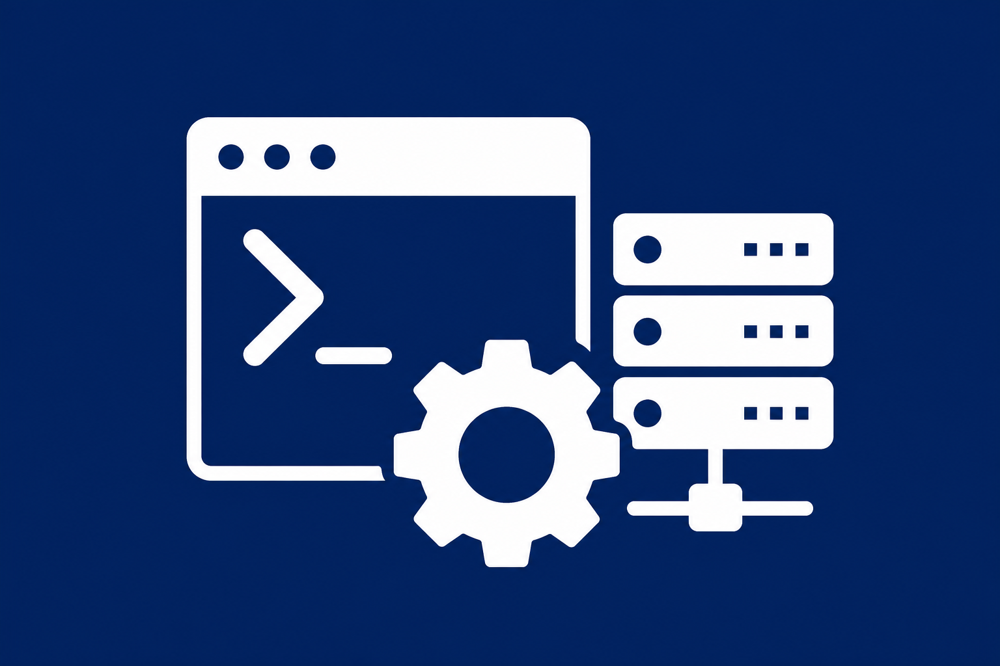

  

## Welcome

This is the documentation site for the [**PowerShell Infrastructure Automation Library**](https://github.com/btstevens1984az/PowerShell) — a curated collection of scripts, modules, and tools built for IT automation engineers.

### What's Inside

- **2,500+ scripts** organized by software platform (Active Directory, Azure, SCCM, McAfee ePO, and more)
- **Reusable modules** in `Modules/<Software>/` for dot-sourcing and import
- **160+ deduplicated symlinks** eliminating redundant copies across folders
- **GUI tools**, shared utilities, snippets, and reference materials

### Quick Links

| Resource | Description |
|----------|-------------|
| [Repository Structure](REPOSITORY-STRUCTURE.md) | Full folder layout and design principles |
| [Deduplication Log](DEDUPLICATION-LOG.md) | Symlink mapping for duplicate scripts |
| [Contributing](CONTRIBUTING.md) | How to add scripts and functions |
| [Code of Conduct](CODE_OF_CONDUCT.md) | Community guidelines |
| [Security Policy](SECURITY.md) | Reporting vulnerabilities |

### Software Catalog

Scripts are organized under `src/<Software>/` — one folder per platform:

**Identity:** [Active Directory](../src/Active-Directory/) · [Group Policy](../src/Group-Policy/) · [DFS](../src/DFS/)

**Cloud:** [Azure](../src/Azure/) · [Microsoft 365](../src/Microsoft-365/) · [222.205.193.149 Online](../src/222.205.193.149-Online/) · [Intune](../src/Intune/) · [Teams](../src/Teams/)

**Endpoint:** [SCCM](../src/SCCM-ConfigMgr/) · [WSUS](../src/WSUS/) · [Windows Updates](../src/Windows-Updates/) · [HP Radia HPCA](../src/HP-Radia-HPCA/)

**Security:** [McAfee ePO](../src/McAfee-ePO/) · [BitLocker](../src/BitLocker/) · [Firewall](../src/Firewall/) · [Certificates](../src/Certificates/)

**Operations:** [Networking](../src/Networking/) · [SQL Server](../src/SQL-Server/) · [SCOM](../src/SCOM/) · [Disk Space](../src/Disk-Space/)

### PowerShell Brand Colors

| Color | Hex | Usage |
|-------|-----|-------|
| PowerShell Blue | `#012456` | Primary branding |
| Cyan Accent | `#00BCF2` | Links and highlights |
| Orange Accent | `#F7630C` | Call-to-action elements |

---

  
  
<em>Built for IT automation engineers who live in the shell.</em>

